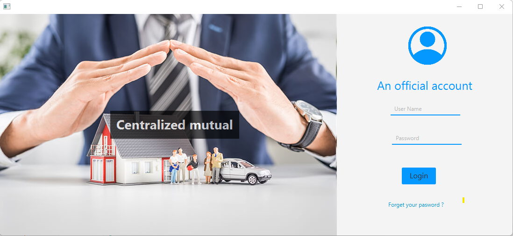

# Centralized-mutual

<h2>Contexte du projet</h2>
La population de la ville de SAFI a dépassé les 320 mille hab/m², le recouvrement médical est partout ainsi que les dossiers envoyés par les personnes cumulent jour après jour, du coup la DSI de la préfecture en collaboration avec la gouvernance des organismes de protection sociale sous tutelle (ressource 1) vont lancer un projet numérique qui vise la gestion des dossiers et des clients pour faciliter leur remboursement en respectant les conditions mutuelles de chacun d’eux.

Bref, votre mission tant que consultant externe chez la préfecture de SAFI est collaborer dans la phase de développement du projet, et mettre en place l’application afin que les opérateurs puissent commencer de l’utiliser. La technologie demandée par le client est du Java 100%, et bien évidement ils ont proposé aussi que l’outil sera un exécutable sur le bureau (application Desktop).

​

<h2>Workflow Phase 1 : </h2>

<h3>++Page 1 : (Authentification)++</h3>

Un fonctionnaire d’une entité de mutuelle (par exemple : OMFAM) peut se connecter sur la plateforme. (Les fonctionnaires sont déjà sauvegardés dans un fichier JSON) ressource 2. NB : (les mots de passe ne sont pas hachés, vous pouvez les crypter Bonus)

​

<h3>++Page 2 / onglet 1 : (Création d’un compte pour un client)++</h3>

Un fonctionnaire peut créer un nouveau client suite à la demande d’organisme mère du client (Par exemple : Ahmed a commencé son nouveau boulot chez la Gendarmerie royale marocaine, cette dernière vont envoyer une demande de création d’un compte à l’OMFAM, et le fonctionnaire va s’occuper du reste.

<h3>Les informations du client sont : </h3>

N° badge de travail : champ texte (10 charactères)
Nom d’entreprise : champ texte (Max 50 charactères)
Date de début de travail : Date picker.
Prénom : champ texte (Max 50 charactères)
Nom : champ texte (Max 50 charactères)
CIN ou bien N° Passeport : radios Button pour choisir et après un champ texte (8 charactères) sous format de (deux lettres et 6 chiffres) si CIN et (deux lettres et 7 chiffres) si passeport.
Téléphone : liste déroulante pour choisir le code pays (+212…) et un champ texte pour le numéro commence directement par (6 ou bien 7 …) (9 chiffres). [La liste des codes pays sous format JSON dans ressource 3].
Email : champ texte qui respecte le format d’email.
Adresse : champ texte (textarea).
Page 2 / onglet 2 : (Afficher les client enregistrés)

Une grille pour afficher les informations des clients.

